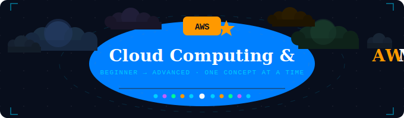

<div align="center">

<!-- Animated Banner -->


<br/>

<!-- Animated badges -->

&nbsp;

&nbsp;

&nbsp;


<br/><br/>

> *A structured, beginner-to-advanced learning repository covering cloud fundamentals through advanced AWS architecture — one concept at a time.*

</div>

---

<br/>

## 📁 Repository Structure

```
📦 cloud-computing-aws-mastery
 ┣ 📂 cloud computing lessons and fundamentals
 ┗ 📂 AWS guide step by step
```

<br/>

---

<br/>

## ☁️ Cloud Computing — Lessons & Fundamentals

> **Folder:** `cloud computing lessons and fundamentals/`

Everything you need to go from zero to confident in cloud computing concepts.

<br/>

### 🌐 Core Concepts

| Concept | Description |
|---|---|
| **What is Cloud Computing?** | On-demand delivery of IT resources over the internet with pay-as-you-go pricing |
| **Cloud vs Traditional IT** | CAPEX vs OPEX, on-premises limitations, why cloud wins |
| **Virtualization** | How hypervisors abstract hardware — the engine behind cloud |
| **Networking Basics** | IP addresses, DNS, subnets, firewalls, and how packets travel |

<br/>

### 🏗️ Service Models

```
┌─────────────────────────────────────────────────────┐
│                                                     │
│   SaaS  ──  Software as a Service   (Gmail, Slack)  │
│   PaaS  ──  Platform as a Service   (Heroku, GAE)   │
│   IaaS  ──  Infrastructure as a Service  (EC2, VMs) │
│                                                     │
└─────────────────────────────────────────────────────┘
```

<br/>

### ☁️ Deployment Models

- 🔵 **Public Cloud** — Resources owned and operated by a third-party provider (AWS, Azure, GCP)
- 🟣 **Private Cloud** — Dedicated infrastructure for a single organisation
- 🟡 **Hybrid Cloud** — Mix of public and private clouds connected together
- 🟢 **Multi-Cloud** — Using more than one cloud provider simultaneously

<br/>

### ⚡ Key Characteristics of Cloud

```
Elasticity          →  Scale up or down instantly
On-demand           →  Pay only for what you use
Broad access        →  Access from anywhere, any device
Resource pooling    →  Shared infrastructure, multi-tenant
Measured service    →  Metered usage and billing
High availability   →  Built-in redundancy and failover
```

<br/>

### 🔒 Cloud Security Fundamentals

- **Shared Responsibility Model** — Cloud provider secures the infrastructure; you secure what's on it
- **Identity & Access Management (IAM)** — Who can do what, and to which resources
- **Encryption** — Data at rest and in transit
- **Compliance** — GDPR, HIPAA, SOC 2, ISO 27001

<br/>

### 💰 Cloud Economics

| Traditional IT | Cloud Computing |
|---|---|
| Large upfront costs (CAPEX) | Pay-as-you-go (OPEX) |
| Over-provisioning for peak | Scale exactly to demand |
| Long procurement cycles | Resources in minutes |
| Fixed capacity | Unlimited scale |

<br/>

---

<br/>

## 🟠 AWS — Step by Step Guide

> **Folder:** `AWS guide step by step/`

Hands-on, concept-by-concept walkthrough of Amazon Web Services.

<br/>

### 🚀 Getting Started with AWS

| Step | Topic |
|---|---|
| 1️⃣ | Create your AWS Free Tier account |
| 2️⃣ | Understand the AWS Global Infrastructure (Regions, AZs, Edge Locations) |
| 3️⃣ | Navigate the AWS Management Console |
| 4️⃣ | Set up billing alerts and budgets |
| 5️⃣ | Configure IAM — never use the root account! |

<br/>

### 🌍 AWS Global Infrastructure

```
Region  →  A geographical area (e.g. us-east-1, ap-south-1)
  └── Availability Zone (AZ)  →  Isolated data centres within a Region
        └── Edge Location     →  CDN endpoints for CloudFront caching
```

<br/>

### 🖥️ Compute Services

| Service | What it does |
|---|---|
| **EC2** | Virtual machines in the cloud — the core compute building block |
| **Lambda** | Run code without managing servers (serverless) |
| **ECS / EKS** | Run containers with Docker / Kubernetes |
| **Elastic Beanstalk** | Deploy apps without worrying about infrastructure |
| **Lightsail** | Simple VPS — great for beginners |

<br/>

### 🗄️ Storage Services

```
S3          →  Object storage — store any file, any size, infinitely scalable
EBS         →  Block storage attached to EC2 instances (like a hard drive)
EFS         →  Elastic file system — shared across multiple EC2 instances
Glacier     →  Ultra-cheap archival storage for backups
```

<br/>

### 🛢️ Database Services

| Service | Type | Use case |
|---|---|---|
| **RDS** | Relational (SQL) | MySQL, PostgreSQL, MariaDB, Oracle |
| **Aurora** | Relational (SQL) | AWS-native, 5× faster than MySQL |
| **DynamoDB** | NoSQL (Key-Value) | Millisecond latency at any scale |
| **ElastiCache** | In-Memory Cache | Redis / Memcached for fast reads |
| **Redshift** | Data Warehouse | Analytics on petabytes of data |

<br/>

### 🌐 Networking on AWS

```
VPC           →  Your private network inside AWS
  ├── Subnet  →  Divide VPC into public & private segments
  ├── IGW     →  Internet Gateway — connects VPC to the internet
  ├── NAT GW  →  Lets private subnets reach the internet (outbound only)
  ├── SG      →  Security Groups — stateful firewall at instance level
  └── NACL    →  Network ACLs — stateless firewall at subnet level

Route 53      →  DNS service + domain registration
CloudFront    →  Global CDN — cache content at edge locations
ELB           →  Elastic Load Balancer — distribute traffic across instances
```

<br/>

### 🔐 Security & Identity

| Service | Purpose |
|---|---|
| **IAM** | Users, groups, roles, and policies — control all access |
| **KMS** | Key Management Service — encrypt your data |
| **Secrets Manager** | Store and rotate credentials securely |
| **Shield** | DDoS protection (Standard is free) |
| **WAF** | Web Application Firewall — block malicious web traffic |
| **CloudTrail** | Audit log of every API call made in your account |

<br/>

### 📊 Monitoring & Management

```
CloudWatch    →  Metrics, logs, alarms, dashboards
CloudTrail    →  API activity history across your account
Config        →  Track configuration changes to AWS resources
Trusted Advisor →  Recommendations for cost, security, and performance
```

<br/>

### ⚙️ DevOps & Automation

| Service | Role |
|---|---|
| **CodeCommit** | Git-based source control (like GitHub on AWS) |
| **CodeBuild** | Build and test code |
| **CodeDeploy** | Automate deployments to EC2 / Lambda |
| **CodePipeline** | Full CI/CD pipeline orchestration |
| **CloudFormation** | Infrastructure as Code — define AWS resources in YAML/JSON |
| **CDK** | Define infrastructure using real programming languages |

<br/>

### 🏆 AWS Certification Roadmap

```
☁️  Cloud Practitioner    ──  Foundation (start here)
        │
        ├──  Solutions Architect Associate   ──  Most popular
        ├──  Developer Associate
        └──  SysOps Administrator Associate
                │
                └──  Professional & Specialty Certs
```

<br/>

---

<br/>

## 🛠️ How to Use This Repo

```bash
# Clone the repository
git clone https://github.com/your-username/cloud-computing-aws-mastery.git

# Navigate to cloud fundamentals
cd "cloud computing lessons and fundamentals"

# Navigate to AWS guide
cd "AWS guide step by step"
```

<br/>

---

<br/>

<div align="center">

### ⭐ Star this repo if it helps you on your cloud journey!

<br/>


&nbsp;


<br/>

*Built to make cloud computing approachable for everyone.*

</div>